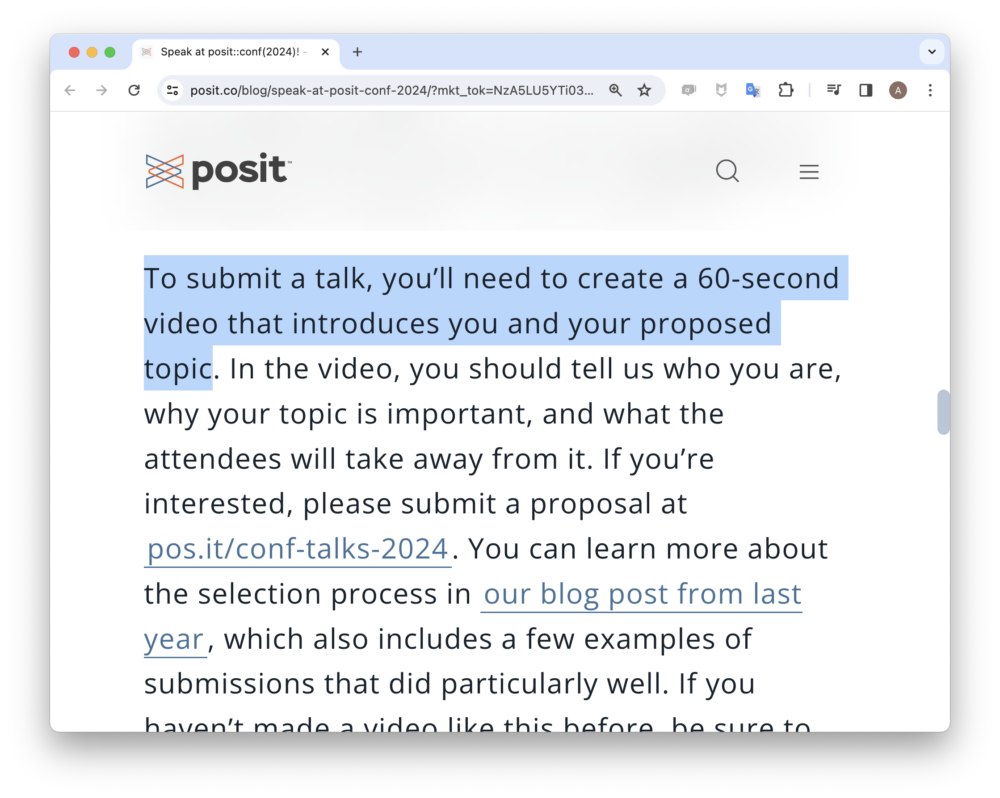

::::: {.cr-layout}

# Closeread

Hello there.

As the deadline for posit::conf approached, I figured I should prepare my proposal, which I presumed involved an abstract.

:::{.cr-crossfade cr-to="abstract"}
750 characters - not a problem!
:::

:::{cr-id="abstract" style="font-size: .8em; padding: 75px"}
Scrollytelling is a style of web design that transitions graphics and text as a user scrolls, allowing stories to progress naturally. Despite its power, scrollytelling typically requires specialist web dev skills beyond the reach of many data scientists.

Closeread is a Quarto extension that makes a wide range of scrollytelling techniques available to authors without traditional web dev experience, with support for cross-fading plots, graphics and other chunk output alongside narrative content. You can zoom in on poems, prose and images, as well as highlighting important phrases of text.

Finally, Closeread allows authors with experience in Observable JS to write their own animated graphics that update smoothly as scrolling progresses.
:::

But then I read the (actually not very) fine print.

:::{.cr-crossfade cr-from="abstract" cr-to="application"}
I saw this.
:::

{cr-id="application"}

Not a problem.

:::{.cr-crossfade cr-from="application"}
40 seconds left.
:::

:::{.cr-crossfade cr-from="application" cr-to="video"}
Let me say hello in person.
:::

:::{cr-id="video"}
<!-- <iframe width="480" height="270" src="https://www.youtube.com/embed/S68i7Oka8G4?si=gmZviGxNdyyCVQUF&amp" frameborder="0" allow="autoplay"></iframe> -->

<iframe src="https://drive.google.com/file/d/1Mju7x6qRmyx-iC7PEyIGAUVph5RVjiYh/preview" width="480" height="270" allow="autoplay"></iframe>

<!--  -->

:::

\

:::::
